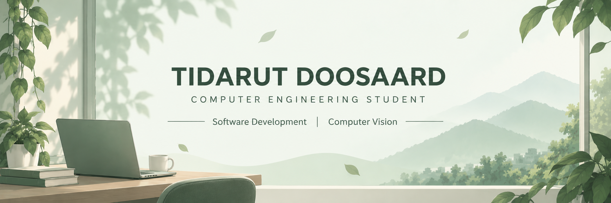

  

---

## About Me

Fourth-year Computer Engineering student with experience in software development, computer vision, database integration, and system development.

## Tech Stack

**Languages**

Python · JavaScript · Lua · SQL · HTML · CSS

**Computer Vision**

OpenCV · MediaPipe · NumPy

**Tools & Development**

Git · GitHub · MySQL · PyAutoGUI

## Featured Projects

### Gesture Presenter

Real-time hand gesture presentation control system developed using Python, OpenCV, and MediaPipe.

The system recognizes hand gestures and maps them to presentation controls such as cursor movement, mouse clicking, slide navigation, and presentation commands.

**Technologies:** Python · OpenCV · MediaPipe · NumPy · PyAutoGUI

[View Repository](https://github.com/nunanina/gesture-presenter.git)

### QBCore Development

Freelance development of custom systems and gameplay functionality for QBCore-based environments.

**Technologies:** Lua · JavaScript · SQL

## Currently

Preparing for cooperative education and interested in opportunities related to:

Software Development · IT

## Contact

Email: tidarutdoosaard@gmail.com
